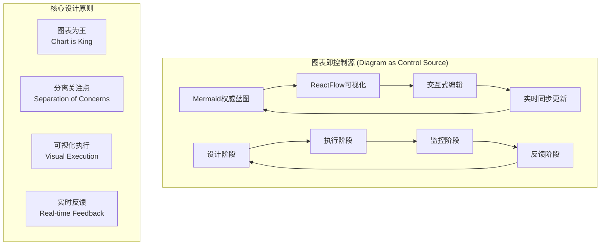
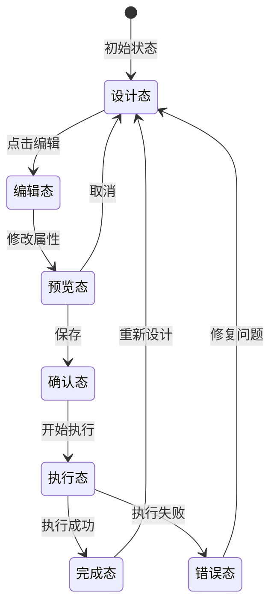
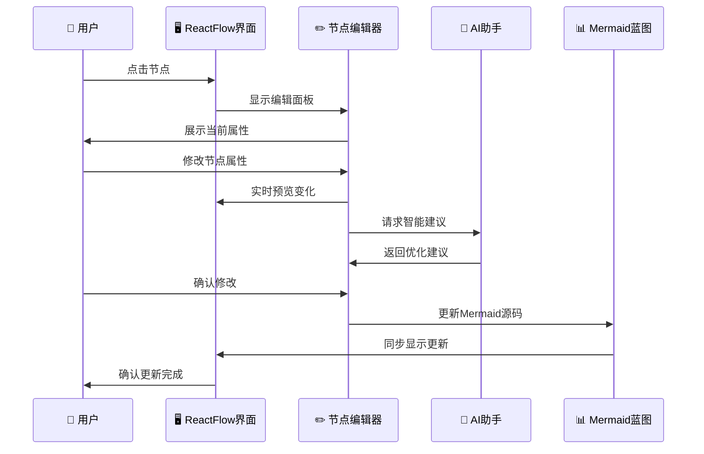
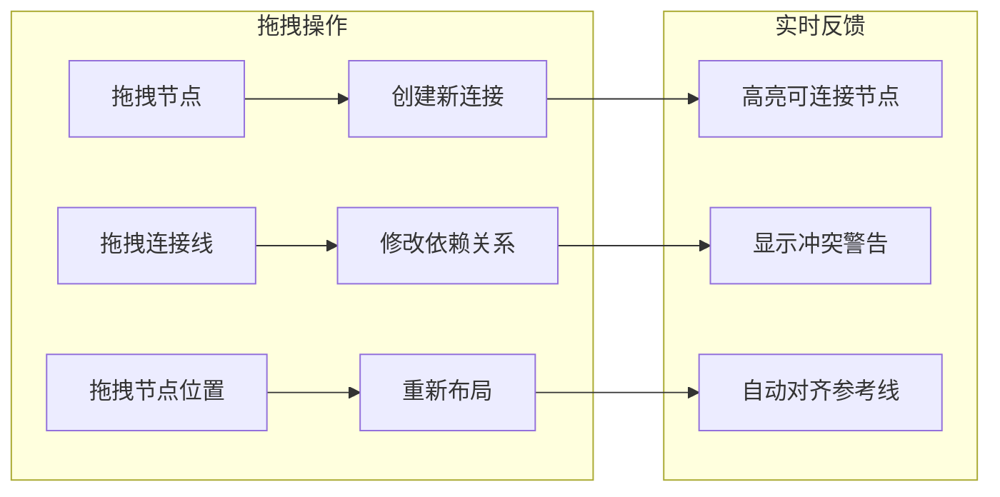
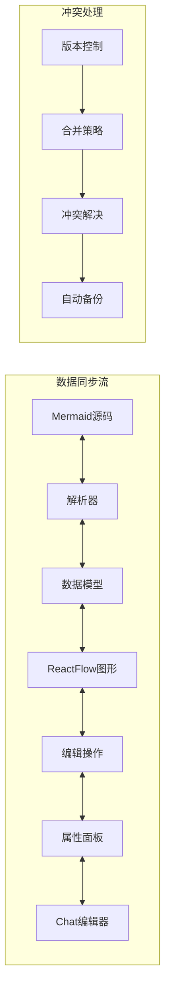
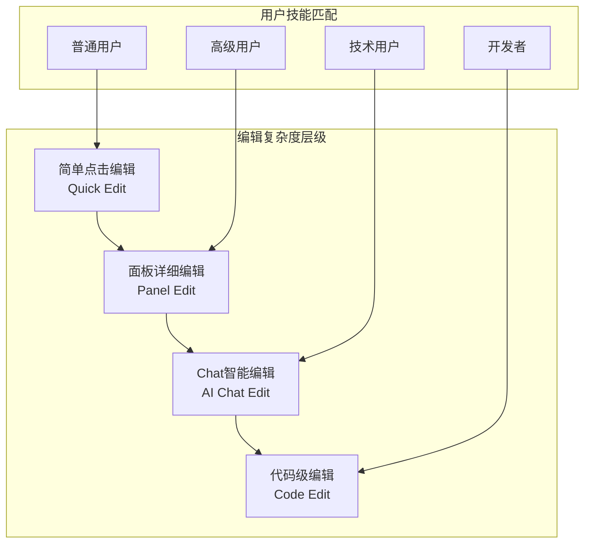
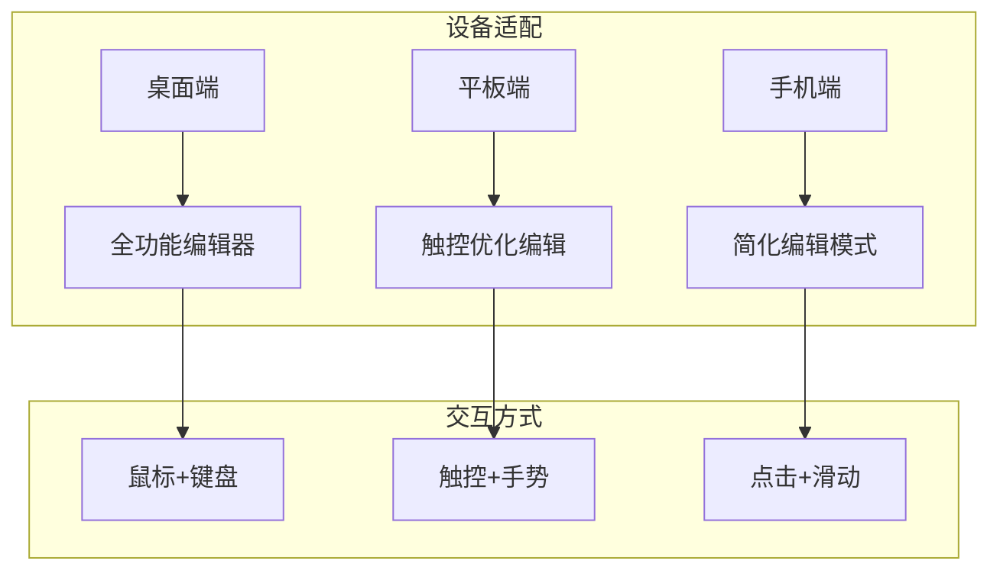

# 交互式图表编辑设计方案

```
Version: v1.0.0
Author: AI Assistant + User
Date: 2024-12-20
Purpose: 设计图表即控制源的交互式编辑系统
Dependencies: ReactFlow, Mermaid, MCP工具, AI Chat集成
设计理念: Diagram as Control Source - 图表即权威蓝图
```



## 🎯 设计核心理念

### 图表即控制源 (Diagram as Control Source)

**核心概念**：
- 📊 **Mermaid图表是权威蓝图**: 所有决策和执行都以图表为准
- 🔄 **设计与执行分离**: 明确区分蓝图设计阶段和执行监控阶段
- 👁️ **可视化执行位置**: 直观展示当前执行到哪个节点
- 🔁 **反馈驱动迭代**: 基于执行反馈更新和优化图表

## 🏗️ 系统架构设计

### 1. 多层编辑架构

```mermaid
graph TB
    subgraph "编辑器层次结构"
        L1[图表浏览层<br/>Chart Viewer] --> L2[节点编辑层<br/>Node Editor]
        L2 --> L3[属性配置层<br/>Property Config]
        L3 --> L4[AI辅助层<br/>AI Assistant]
        L4 --> L5[版本控制层<br/>Version Control]
    end
    
    subgraph "数据流向"
        D1[Mermaid源码] --> D2[解析器]
        D2 --> D3[图形对象模型]
        D3 --> D4[ReactFlow节点]
        D4 --> D5[编辑操作]
        D5 --> D1
    end
    
    subgraph "交互机制"
        I1[点击节点] --> I2[弹出编辑面板]
        I2 --> I3[属性修改]
        I3 --> I4[实时预览]
        I4 --> I5[确认更新]
        I5 --> I6[同步到Mermaid]
    end
```



### 2. 节点交互设计

#### 节点状态可视化


#### 节点编辑面板设计
```typescript
interface NodeEditPanel {
  nodeId: string;
  nodeType: 'function' | 'logic' | 'code' | 'order';
  
  // 基础属性
  basicInfo: {
    title: string;
    description: string;
    priority: number;
    estimatedTime: string;
  };
  
  // 依赖关系
  dependencies: {
    prerequisites: string[];
    blockers: string[];
    outputs: string[];
  };
  
  // 执行状态
  executionState: {
    status: 'pending' | 'running' | 'completed' | 'failed';
    progress: number;
    startTime?: Date;
    endTime?: Date;
    logs: string[];
  };
  
  // AI建议
  aiSuggestions: {
    recommendations: string[];
    risks: string[];
    optimizations: string[];
  };
}
```

## 🎨 交互式编辑功能设计

### 1. 节点编辑交互流程



### 2. 智能编辑特性

#### 自动补全和建议
```typescript
interface SmartEditFeatures {
  // 自动补全
  autoComplete: {
    nodeNames: string[];
    dependencies: string[];
    templates: NodeTemplate[];
  };
  
  // 智能建议
  suggestions: {
    dependencyOptimization: () => string[];
    performanceImprovement: () => string[];
    riskMitigation: () => string[];
  };
  
  // 实时验证
  validation: {
    cyclicDependencyCheck: () => boolean;
    resourceConflictCheck: () => string[];
    timelineConsistencyCheck: () => boolean;
  };
}
```

#### 拖拽编辑功能


### 3. Chat集成设计

#### 右键菜单 → Chat编辑
```mermaid
graph TD
    A[右键点击节点] --> B[弹出上下文菜单]
    B --> C[选择 "在Chat中编辑"]
    C --> D[打开AI对话窗口]
    D --> E[加载节点上下文]
    E --> F[用户描述修改需求]
    F --> G[AI生成修改建议]
    G --> H[用户确认修改]
    H --> I[应用到图表]
    I --> J[同步更新视图]
```

#### Chat编辑界面设计
```typescript
interface ChatEditInterface {
  // 上下文信息
  context: {
    nodeData: NodeEditPanel;
    relatedNodes: NodeInfo[];
    layerContext: LayerType;
    projectOverview: string;
  };
  
  // 对话历史
  chatHistory: ChatMessage[];
  
  // 编辑建议
  editSuggestions: {
    structuralChanges: string[];
    propertyUpdates: Record<string, any>;
    dependencyAdjustments: string[];
  };
  
  // 预览功能
  preview: {
    beforeAfterComparison: () => void;
    impactAnalysis: () => string[];
    validationResults: () => ValidationResult[];
  };
}
```

## 🔄 实时同步机制

### 1. 双向绑定设计



### 2. 状态管理策略

```typescript
interface StateManagement {
  // 全局状态
  globalState: {
    currentDiagram: MermaidDiagram;
    editHistory: EditOperation[];
    activeSelections: NodeSelection[];
  };
  
  // 同步策略
  syncStrategy: {
    realTimeSync: boolean;
    batchUpdates: boolean;
    conflictResolution: 'merge' | 'override' | 'manual';
  };
  
  // 性能优化
  performance: {
    virtualScrolling: boolean;
    lazyLoading: boolean;
    debounceTime: number;
  };
}
```

## 🎯 用户体验设计

### 1. 渐进式编辑复杂度



### 2. 智能引导系统

```typescript
interface SmartGuidance {
  // 新手引导
  onboarding: {
    interactiveTutorial: () => void;
    contextualTips: () => string[];
    progressTracking: () => number;
  };
  
  // 操作建议
  actionSuggestions: {
    nextBestAction: () => string;
    shortcutHints: () => string[];
    efficiencyTips: () => string[];
  };
  
  // 错误预防
  errorPrevention: {
    warningSystem: () => void;
    undoRedoStack: EditOperation[];
    safetyChecks: () => boolean;
  };
}
```

## 📱 多设备适配

### 1. 响应式编辑界面



### 2. 跨设备同步

```typescript
interface CrossDeviceSync {
  // 云同步
  cloudSync: {
    autoSave: boolean;
    conflictResolution: string;
    offlineSupport: boolean;
  };
  
  // 设备特化
  deviceOptimization: {
    desktop: DesktopFeatures;
    tablet: TabletFeatures;
    mobile: MobileFeatures;
  };
}
```

## 🚀 实现优先级

### Phase 1: 基础交互编辑
- ✅ 节点点击编辑
- ✅ 基础属性面板
- ✅ 实时预览功能
- ✅ 简单验证机制

### Phase 2: 智能编辑增强
- 🔄 AI建议集成
- 🔄 Chat编辑功能
- 🔄 拖拽操作支持
- 🔄 冲突检测和解决

### Phase 3: 高级功能
- ⏳ 版本控制系统
- ⏳ 多人协作编辑
- ⏳ 插件化架构
- ⏳ 自定义主题

## 🎯 成功指标

### 用户体验指标
- **编辑效率**: 比传统方式提升50%以上
- **学习曲线**: 新用户15分钟内掌握基础编辑
- **错误率**: 编辑错误率低于5%
- **满意度**: 用户满意度评分>4.5/5.0

### 技术性能指标
- **响应时间**: 编辑操作响应时间<100ms
- **同步延迟**: 跨设备同步延迟<500ms
- **稳定性**: 系统正常运行时间>99.9%
- **兼容性**: 支持主流浏览器>95%

---

**设计总结**: 通过"图表即控制源"的理念，我们构建了一个以可视化图表为中心的交互式编辑系统，实现了设计与执行的有机统一，为用户提供了直观、高效、智能的项目管理体验。 