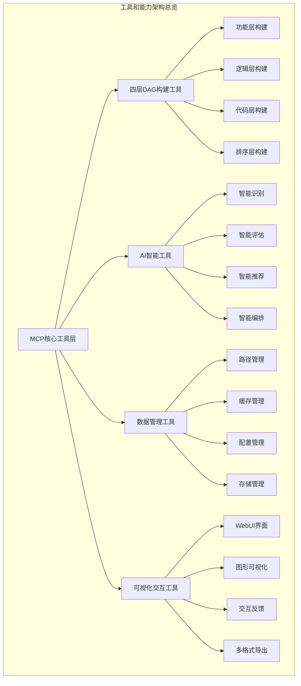
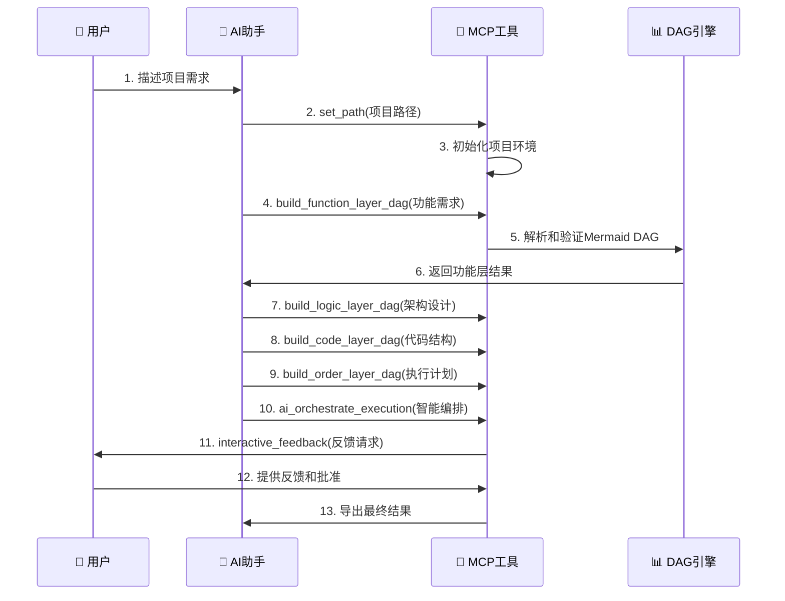

# MCP-DAG-planner 工具和能力清单

```
Version: v1.0.0
Author: AI Assistant + User  
Date: 2024-12-20
Purpose: mcp-DAG-planner项目的完整工具和能力清单
Dependencies: MCP协议, FastMCP, graphology, ReactFlow, Mermaid
更新频率: 与每次代码变更同步更新
```



## 📋 工具分类索引

| 工具类别 | 工具数量 | 主要功能 | 文档章节 |
|---------|---------|---------|---------|
| **MCP核心工具** | 5+ | 交互反馈、系统信息 | [1. MCP核心工具层](#1-mcp核心工具层) |
| **四层DAG构建工具** | 4 | 功能/逻辑/代码/排序层构建 | [2. 四层DAG构建工具](#2-四层dag构建工具) |
| **AI智能工具** | 5 | 智能识别、评估、推荐、编排 | [3. AI智能工具](#3-ai智能工具) |
| **项目管理工具** | 8+ | 路径、缓存、配置管理 | [4. 项目管理工具](#4-项目管理工具) |
| **可视化交互工具** | 6+ | WebUI、图形展示、导出 | [5. 可视化交互工具](#5-可视化交互工具) |

---

## 1. MCP核心工具层

### 1.1 interactive_feedback - 交互式反馈核心

**工具名称**: `interactive_feedback`  
**类型**: MCP工具  
**功能**: AI助手与用户进行交互式回馈的核心MCP工具

#### 函数签名
```python
async def interactive_feedback(
    project_directory: str,
    summary: str, 
    timeout: int = 600
) -> dict
```

#### 参数说明
| 参数 | 类型 | 必需 | 默认值 | 描述 |
|------|------|------|--------|------|
| `project_directory` | `str` | ✅ | - | 项目目录路径，用于上下文显示 |
| `summary` | `str` | ✅ | - | AI助手的工作摘要 |
| `timeout` | `int` | ❌ | `600` | 等待用户回馈的超时时间（秒） |

#### 返回值
```json
{
    "command_logs": "",
    "interactive_feedback": "用户回馈内容",
    "images": ["Base64编码的图片列表"]
}
```

#### 核心能力
- ✅ **实时交互反馈**: 支持文字和图片反馈
- ✅ **环境智能检测**: 自动选择WebUI或命令行模式
- ✅ **多语言支持**: 中文、英文、繁体中文界面
- ✅ **会话状态管理**: 维护交互会话状态
- ✅ **超时处理机制**: 防止无限等待

### 1.2 get_system_info - 系统信息获取

**工具名称**: `get_system_info`  
**类型**: MCP工具  
**功能**: 获取系统环境信息

#### 函数签名
```python
def get_system_info(random_string: str) -> str
```

#### 核心能力
- ✅ **系统环境检测**: 操作系统、Python版本
- ✅ **资源状态监控**: 内存、CPU使用情况
- ✅ **依赖检查**: 检查必要依赖是否安装
- ✅ **配置状态**: 当前配置信息

### 1.3 get_current_path - 路径状态检查

**工具名称**: `get_current_path`  
**类型**: MCP工具  
**功能**: 获取当前项目路径并检查初始化状态

#### 函数签名
```python
def get_current_path(project_path: str) -> str
```

#### 核心能力
- ✅ **路径验证**: 检查项目路径有效性
- ✅ **初始化状态检查**: 验证.EDATA目录和配置文件
- ✅ **依赖完整性验证**: 检查必要文件是否存在

---

## 2. 四层DAG构建工具

### 2.1 build_function_layer_dag - 功能层构建

**工具名称**: `build_function_layer_dag`  
**类型**: 四层DAG工具  
**功能**: 构建功能层DAG (What Layer - 业务目标层)

#### 函数签名
```python
def build_function_layer_dag(
    project_path: str,
    project_description: str,
    mermaid_dag: str,
    business_requirements: str
) -> str
```

#### 参数说明
| 参数 | 类型 | 描述 |
|------|------|------|
| `project_path` | `str` | 项目根目录路径，必须指定 |
| `project_description` | `str` | 项目的整体描述和目标 |
| `mermaid_dag` | `str` | 功能层的Mermaid DAG描述（由AI生成） |
| `business_requirements` | `str` | 具体的业务需求列表 |

#### 专注领域
- 🎯 **业务功能识别和分解**: 将复杂业务需求分解为具体功能模块
- 🔗 **功能模块依赖关系**: 建立功能间的逻辑依赖关系  
- 📋 **用户需求到功能的映射**: 确保每个需求都有对应功能
- ⭐ **功能优先级和价值评估**: 评估功能的业务价值和优先级

#### 输出示例
```json
{
  "success": true,
  "layer_type": "function",
  "layer_name": "功能层 (What Layer)",
  "description": "业务目标和功能需求层",
  "parsed_dag": {
    "metadata": {
      "layer": "function",
      "focus": ["业务功能识别", "功能模块依赖", "需求映射", "优先级评估"],
      "node_count": 4,
      "edge_count": 3
    }
  },
  "validation": {
    "is_valid": true,
    "validation_messages": ["功能层 DAG 接收成功"]
  }
}
```

### 2.2 build_logic_layer_dag - 逻辑层构建

**工具名称**: `build_logic_layer_dag`  
**类型**: 四层DAG工具  
**功能**: 构建逻辑层DAG (How Layer - 技术架构层)

#### 函数签名
```python
def build_logic_layer_dag(
    function_layer_result: str,
    mermaid_dag: str,
    technical_architecture: str
) -> str
```

#### 参数说明
| 参数 | 类型 | 描述 |
|------|------|------|
| `function_layer_result` | `str` | 功能层的构建结果（JSON格式） |
| `mermaid_dag` | `str` | 逻辑层的Mermaid DAG描述（由AI生成） |
| `technical_architecture` | `str` | 技术架构的详细设计 |

#### 专注领域
- 🏗️ **技术架构设计**: 系统整体架构和技术选型
- 🔧 **系统组件关系**: 各技术组件间的依赖和交互关系
- 🌐 **API和接口定义**: 系统内外部接口规范
- 📊 **数据流和控制流**: 数据在系统中的流转路径

### 2.3 build_code_layer_dag - 代码层构建

**工具名称**: `build_code_layer_dag`  
**类型**: 四层DAG工具  
**功能**: 构建代码层DAG (Code Layer - 实现架构层)

#### 函数签名
```python
def build_code_layer_dag(
    logic_layer_result: str,
    mermaid_dag: str,
    implementation_details: str
) -> str
```

#### 参数说明
| 参数 | 类型 | 描述 |
|------|------|------|
| `logic_layer_result` | `str` | 逻辑层的构建结果（JSON格式） |
| `mermaid_dag` | `str` | 代码层的Mermaid DAG描述（由AI生成） |
| `implementation_details` | `str` | 实现细节和技术选型说明 |

#### 专注领域
- 📁 **代码模块结构**: 代码的组织和模块划分
- 🗂️ **文件组织架构**: 项目文件和目录结构设计
- 🏛️ **类和函数设计**: 面向对象设计和函数接口定义
- 🔗 **依赖关系管理**: 代码间的依赖关系和导入结构

### 2.4 build_order_layer_dag - 排序层构建

**工具名称**: `build_order_layer_dag`  
**类型**: 四层DAG工具  
**功能**: 构建排序层DAG (When Layer - 执行顺序层)

#### 函数签名
```python
def build_order_layer_dag(
    code_layer_result: str,
    mermaid_dag: str,
    execution_strategy: str
) -> str
```

#### 参数说明
| 参数 | 类型 | 描述 |
|------|------|------|
| `code_layer_result` | `str` | 代码层的构建结果（JSON格式） |
| `mermaid_dag` | `str` | 排序层的Mermaid DAG描述（由AI生成） |
| `execution_strategy` | `str` | 执行策略和时序安排说明 |

#### 专注领域
- 📅 **执行顺序规划**: 任务和阶段的时间安排
- 🔗 **任务依赖关系**: 任务间的前置和后置依赖
- 💰 **资源分配计划**: 人力、时间、技术资源的分配
- ⏰ **时间节点安排**: 关键里程碑和交付节点

---

## 3. AI智能工具

### 3.1 ai_identify_current_node - 智能节点识别

**工具名称**: `ai_identify_current_node`  
**类型**: AI智能工具  
**功能**: AI智能识别当前应该执行的节点

#### 函数签名
```python
def ai_identify_current_node(
    dag_data: str,
    execution_context: str,
    additional_info: str = ""
) -> str
```

#### 参数说明
| 参数 | 类型 | 描述 |
|------|------|------|
| `dag_data` | `str` | 4层DAG数据JSON字符串，包含完整的DAG结构信息 |
| `execution_context` | `str` | 执行上下文JSON字符串，包含当前状态、完成节点、进行中节点等信息 |
| `additional_info` | `str` | 额外信息和提示，如用户当前工作、最近操作等 |

#### 核心能力
- 🧠 **智能上下文分析**: 分析4层DAG结构和执行状态
- 🎯 **精准节点定位**: 基于上下文智能判断当前位置
- 📊 **置信度评估**: 提供置信度和备选方案
- 📋 **详细推理说明**: 给出详细的分析reasoning

#### AI分析维度
- **节点依赖关系分析**: 检查前置条件是否满足
- **执行状态一致性检查**: 验证状态转换的合理性
- **上下文理解和推理**: 理解项目背景和当前情况
- **风险评估和建议**: 识别潜在风险并给出建议

### 3.2 ai_evaluate_node_completion - 智能完成度评估

**工具名称**: `ai_evaluate_node_completion`  
**类型**: AI智能工具  
**功能**: AI智能评估节点完成状态和质量

#### 函数签名
```python
def ai_evaluate_node_completion(
    node_id: str,
    node_data: str,
    completion_evidence: str,
    quality_criteria: str = ""
) -> str
```

#### 参数说明
| 参数 | 类型 | 描述 |
|------|------|------|
| `node_id` | `str` | 要评估的节点唯一标识 |
| `node_data` | `str` | 节点数据JSON字符串，包含节点定义、输出要求等 |
| `completion_evidence` | `str` | 完成证据和输出，如交付物、文档、代码等 |
| `quality_criteria` | `str` | 质量标准和验收条件 |

#### 核心能力
- ✅ **完成度评估**: 评估节点是否达到完成标准
- 📊 **质量分数计算**: 分析完成度和质量分数
- 🔍 **问题识别**: 识别存在的问题和阻塞
- 💡 **改进建议**: 提供改进建议和下一步行动

#### AI评估维度
- **交付物完整性检查**: 验证所有要求的交付物是否完成
- **质量标准符合度评估**: 评估是否满足预定义的质量标准
- **验收条件满足情况**: 检查是否满足验收条件
- **潜在风险和改进点**: 识别风险并提出改进建议

### 3.3 ai_recommend_next_node - 智能下一步推荐

**工具名称**: `ai_recommend_next_node`  
**类型**: AI智能工具  
**功能**: AI智能推荐下一个执行节点

#### 函数签名
```python
def ai_recommend_next_node(
    current_node: str,
    dag_data: str,
    resource_state: str,
    constraints: str = ""
) -> str
```

#### 参数说明
| 参数 | 类型 | 描述 |
|------|------|------|
| `current_node` | `str` | 当前节点信息JSON字符串 |
| `dag_data` | `str` | 4层DAG数据JSON字符串 |
| `resource_state` | `str` | 资源状态JSON字符串，包含可用资源、约束条件等 |
| `constraints` | `str` | 约束条件，如时间限制、优先级要求等 |

#### 核心能力
- 🎯 **最优路径推荐**: 分析可执行节点和依赖关系
- ⚖️ **资源约束考虑**: 考虑资源可用性和约束
- 🚀 **并行执行识别**: 识别可并行执行的机会
- 📈 **执行路径建议**: 提供执行路径建议

#### AI推荐维度
- **依赖关系拓扑分析**: 分析节点间的依赖关系
- **资源可用性评估**: 评估当前资源状态
- **优先级和风险权衡**: 平衡优先级和风险
- **并行执行优化**: 寻找并行执行机会

### 3.4 ai_decide_state_update - 智能状态更新决策

**工具名称**: `ai_decide_state_update`  
**类型**: AI智能工具  
**功能**: AI智能决策节点状态更新方案

#### 函数签名
```python
def ai_decide_state_update(
    node_id: str,
    completion_result: str,
    impact_scope: str,
    update_options: str = ""
) -> str
```

#### 参数说明
| 参数 | 类型 | 描述 |
|------|------|------|
| `node_id` | `str` | 节点ID |
| `completion_result` | `str` | 完成评估结果JSON，来自ai_evaluate_node_completion |
| `impact_scope` | `str` | 影响范围分析，包含下游节点、依赖关系等 |
| `update_options` | `str` | 可选更新方案，如状态转换选项 |

#### 核心能力
- 🔄 **最优状态转换**: 决定最优的状态转换
- 🌊 **级联影响分析**: 分析级联影响和更新
- 📢 **通知策略制定**: 制定通知和回滚策略
- ⚠️ **风险评估**: 评估更新风险

#### AI决策维度
- **状态转换合理性**: 验证状态转换的合理性
- **级联影响评估**: 评估对其他节点的影响
- **回滚风险控制**: 控制回滚风险
- **通知优先级**: 确定通知的优先级

### 3.5 ai_orchestrate_execution - 智能执行编排

**工具名称**: `ai_orchestrate_execution`  
**类型**: AI智能工具  
**功能**: AI智能编排4层DAG执行流程

#### 函数签名
```python
def ai_orchestrate_execution(
    dag_data: str,
    execution_config: str,
    user_preferences: str = ""
) -> str
```

#### 参数说明
| 参数 | 类型 | 描述 |
|------|------|------|
| `dag_data` | `str` | 4层DAG数据JSON字符串 |
| `execution_config` | `str` | 执行配置JSON字符串，包含各种设置和约束 |
| `user_preferences` | `str` | 用户偏好，如反馈频率、决策参与度等 |

#### 核心能力
- 🎼 **智能调度和资源分配**: 整合四大AI Agent的智能决策
- 🔄 **生命周期管理**: 管理执行生命周期
- 🛠️ **异常处理和变更**: 处理异常和变更
- 📊 **实时执行报告**: 提供实时执行报告

#### 编排策略
- **智能调度和资源分配**: 优化资源使用和任务调度
- **动态调整执行策略**: 根据情况动态调整策略
- **异常检测和恢复**: 检测异常并实施恢复措施
- **持续优化和学习**: 从执行中学习并持续优化

---

## 4. 项目管理工具

### 4.1 路径管理工具组

#### set_path - 智能设置项目路径
**工具名称**: `set_path`  
**功能**: 智能设置项目路径 - 自动检查并初始化

```python
def set_path(project_path: str) -> str
```

**核心能力**:
- 🔍 **智能路径检查**: 检查指定路径是否已有完整的.EDATA目录结构
- ⚡ **自动初始化**: 如果不存在或不完整，自动进行初始化
- 📁 **目录结构验证**: 验证配置文件和必要目录的完整性

#### init_path - 初始化项目路径
**工具名称**: `init_path`  
**功能**: 初始化项目路径和配置

```python
def init_path(project_path: str) -> str
```

**核心能力**:
- 📁 **目录结构创建**: 创建.EDATA目录结构
- ⚙️ **配置文件生成**: 创建必要的配置文件
- 🎯 **项目设置初始化**: 初始化项目设置

#### get_project_path - 获取项目路径
**工具名称**: `get_project_path`  
**功能**: 获取当前项目的工作路径

```python
def get_project_path(random_string: str) -> str
```

### 4.2 缓存管理工具组

#### list_cached_projects - 列出缓存项目
**工具名称**: `list_cached_projects`  
**功能**: 列出所有缓存的项目路径

```python
def list_cached_projects(random_string: str) -> str
```

**核心能力**:
- 📋 **项目列表展示**: 从YAML缓存中列出所有已缓存的项目路径信息
- ✅ **项目状态验证**: 包含项目状态验证，显示项目名称、路径、有效性等信息

#### get_cached_project_path - 获取缓存项目路径
**工具名称**: `get_cached_project_path`  
**功能**: 从缓存中获取项目路径

```python
def get_cached_project_path(project_name: str = "") -> str
```

**核心能力**:
- 🎯 **精确查找**: 根据项目名称查找特定项目
- 🕒 **最近活跃**: 如果不指定项目名称则返回最近活跃的项目

#### add_project_to_cache - 添加项目到缓存
**工具名称**: `add_project_to_cache`  
**功能**: 手动添加项目路径到缓存

```python
def add_project_to_cache(
    project_name: str = "",
    project_path: str = "",
    description: str = ""
) -> str
```

#### remove_project_from_cache - 从缓存移除项目
**工具名称**: `remove_project_from_cache`  
**功能**: 从缓存中移除项目

```python
def remove_project_from_cache(project_name: str = "") -> str
```

### 4.3 配置管理工具

#### initialize_project_config - 初始化项目配置
**工具名称**: `initialize_project_config`  
**功能**: 初始化项目配置文件和目录结构

```python
def initialize_project_config(project_path: str = "") -> str
```

**核心能力**:
- 📁 **目录结构创建**: 在指定路径下创建DAG数据目录
- ⚙️ **配置文件初始化**: 创建必要的配置文件
- 🔧 **环境设置**: 配置项目运行环境

---

## 5. 可视化交互工具

### 5.1 WebUI界面系统

#### 核心界面组件
- 🖥️ **主反馈界面**: 基于mcp-feedback-enhanced的成熟WebUI机制
- 📊 **四层DAG可视化组件**: 使用ReactFlow进行图形展示
- 📈 **迭代进度监控面板**: 实时显示迭代进度和状态
- 📝 **反馈意见收集表单**: 收集用户文字和图片反馈
- ✏️ **修改建议输入区域**: 用户输入修改建议和指导

#### WebSocket通信协议
```javascript
// 连接端点
ws://localhost:{port}/ws

// 消息格式
{
    "type": "message_type",
    "data": { /* 消息数据 */ },
    "timestamp": "2024-12-XX 10:30:00"
}
```

### 5.2 图形可视化能力

#### 支持的可视化格式
- 📈 **Mermaid图表**: 标准的Mermaid语法图表展示
- 🕸️ **ReactFlow交互图**: 可交互的节点关系图
- 📊 **graphology数据**: 图论标准数据格式
- 🎨 **自定义图表**: 支持自定义样式和主题

#### 可视化特性
- 🔍 **缩放和平移**: 支持图表的缩放和平移操作
- 🎯 **节点高亮**: 支持节点的选择和高亮显示
- 📱 **响应式设计**: 适配不同屏幕尺寸
- 🎨 **主题切换**: 支持多种视觉主题

### 5.3 多格式导出工具

#### 支持的导出格式
- 📄 **JSON格式**: 标准的DAG数据JSON导出
- 📊 **Mermaid格式**: 可用于文档的Mermaid图表
- 🕸️ **GraphML格式**: 图论分析软件兼容格式
- 📋 **Excel报告**: 结构化的项目报告
- 📑 **PDF文档**: 完整的项目文档

#### 导出能力
- 📈 **质量报告生成**: 生成详细的质量分析报告
- 📊 **统计数据导出**: 导出项目统计和度量数据
- 🔄 **版本历史**: 导出迭代历史和变更记录
- 📝 **文档生成**: 自动生成项目文档

---

## 6. 使用流程和最佳实践

### 6.1 工具使用的典型流程



### 6.2 最佳实践建议

#### 🎯 项目启动阶段
1. **使用`set_path`智能初始化项目**
2. **准确描述项目目标和业务需求**
3. **设置合适的反馈频率和参数**

#### 🔄 迭代构建阶段
1. **按顺序使用四层DAG构建工具**
2. **充分利用AI智能工具进行质量控制**
3. **及时响应`interactive_feedback`的反馈请求**

#### 📊 监控和优化阶段
1. **使用AI智能工具监控执行状态**
2. **定期查看可视化界面了解进度**
3. **利用导出工具生成项目文档**

---

## 7. 工具集成和扩展能力

### 7.1 与外部系统的集成

#### MCP协议兼容
- ✅ **FastMCP框架**: 基于成熟的FastMCP框架构建
- ✅ **标准MCP协议**: 完全兼容MCP协议规范
- ✅ **多客户端支持**: 支持多种MCP客户端

#### 数据格式兼容
- 📊 **graphology**: 支持图论标准数据格式
- 🕸️ **ReactFlow**: 支持前端可视化组件
- 📈 **Mermaid**: 支持文档化图表格式
- 📄 **JSON**: 标准的数据交换格式

### 7.2 扩展能力

#### 插件化架构
- 🔌 **工具插件**: 支持自定义工具插件
- 🎨 **主题扩展**: 支持自定义UI主题
- 🌐 **语言包**: 支持多语言扩展
- 📋 **模板系统**: 支持自定义项目模板

#### API开放性
- 🔗 **REST API**: 提供完整的REST API接口
- 🌐 **WebSocket**: 支持实时通信
- 📡 **MCP接口**: 标准的MCP工具接口
- 🔧 **配置API**: 支持动态配置管理

---

## 8. 版本历史和更新计划

### 8.1 当前版本状态

**版本**: v1.0.0  
**发布日期**: 2024-12-20  
**主要特性**: 
- ✅ 四层DAG构建工具完整实现
- ✅ AI智能工具基础版本
- ✅ 项目管理工具完整功能
- ✅ WebUI交互界面稳定运行

### 8.2 计划更新内容

#### v1.1.0 计划
- 🔄 **迭代引擎优化**: 提升收敛算法效率
- 📊 **更多可视化选项**: 增加图表类型和样式
- 🤖 **AI能力增强**: 提升智能推荐准确性
- 🌐 **多语言完善**: 完善国际化支持

#### v1.2.0 计划
- 🔌 **插件系统**: 实现完整的插件化架构
- 📱 **移动端支持**: 增加移动设备适配
- ☁️ **云端集成**: 支持云端存储和协作
- 📈 **高级分析**: 增加项目分析和预测功能

---

## 🎯 总结

mcp-DAG-planner 提供了一套完整的工具链，涵盖：

- **27+ 个核心工具**: 覆盖从基础交互到高级AI智能的完整功能
- **4层架构支持**: 完整的What/How/Code/When四层DAG构建
- **AI智能增强**: 5个核心AI工具提供智能决策支持  
- **全方位项目管理**: 从路径管理到配置管理的完整生命周期
- **丰富的可视化**: 多种图表格式和交互方式
- **开放的扩展性**: 支持插件和自定义扩展

这些工具共同构成了一个强大的项目规划和管理平台，通过人机协作的方式，大幅提升复杂项目的规划效率和质量。

---

**文档维护**: 本文档随代码更新同步维护，确保信息的准确性和完整性。  
**技术支持**: 如有工具使用问题，请参考各工具的详细文档或联系技术支持。 