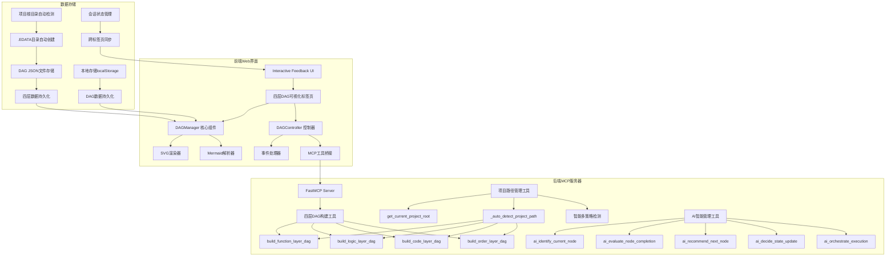
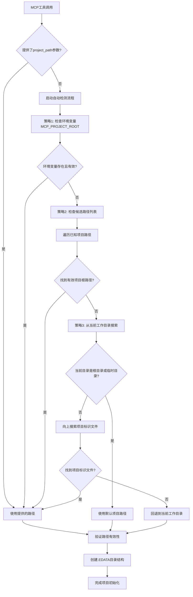
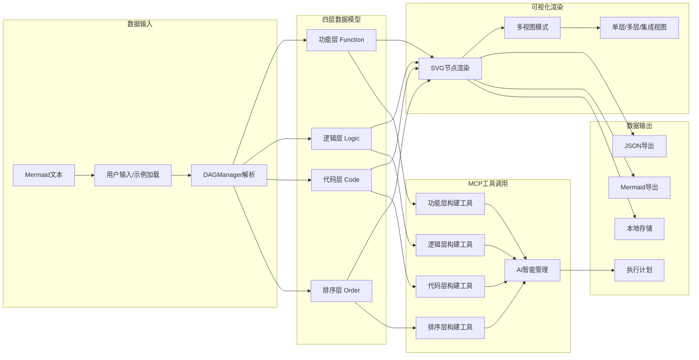
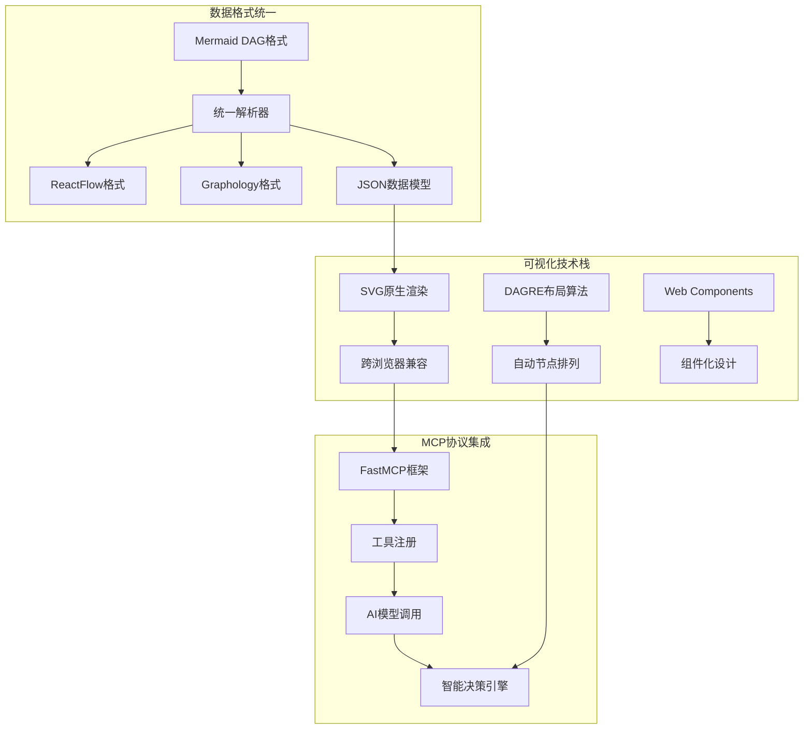
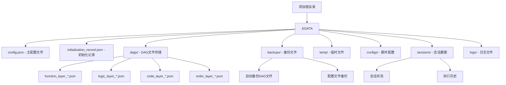
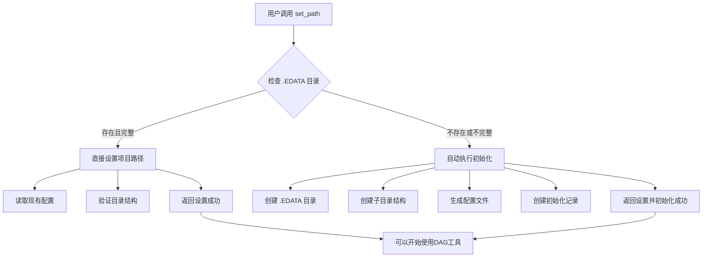
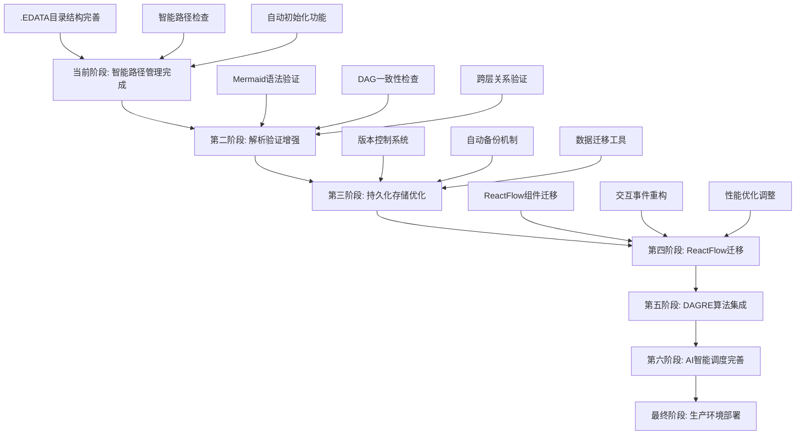
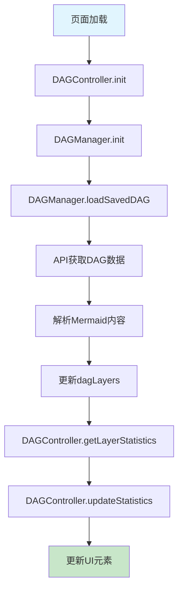

# MCP-DAG-planner 项目架构图

Version: v1.2.0
Date: 2025-06-19
Purpose: 记录四层DAG可视化系统的架构设计和数据流转

## 最新功能增强记录 (2025-06-19)

**核心功能完成**: 项目根路径自动检测工具开发完成
- **新增工具**: `get_current_project_root` - 解决MCP多工作区路径混乱问题
- **核心特性**:
  1. **智能路径检测**: 自动向上搜索项目标识文件(.git, pyproject.toml等)
  2. **多策略检测**: 环境变量 → 候选路径 → 当前目录 → 默认回退
  3. **工作区隔离**: 确保不同Cursor工作区的项目完全隔离
  4. **安全回退**: 避免在根目录或临时目录创建.EDATA

- **集成改造**: 四层DAG构建工具全部支持自动路径检测
  - `build_function_layer_dag` ✅ 支持project_path留空自动检测
  - `build_logic_layer_dag` ✅ 支持project_path留空自动检测  
  - `build_code_layer_dag` ✅ 支持project_path留空自动检测
  - `build_order_layer_dag` ✅ 支持project_path留空自动检测
  - `get_saved_dags` ✅ 支持project_path留空自动检测

- **实战验证**: 成功构建完整四层DAG示例
  - 功能层：9个节点 (需求分析→功能设计→前后端开发→测试验证)
  - 逻辑层：11个节点 (系统架构→技术选型→数据模型→API→集成优化)
  - 代码层：14个节点 (项目初始化→模块开发→测试→优化)
  - 排序层：23个节点 (六阶段执行流程，从基础设施到运维监控)

- **存储验证**: 
  - ✅ 项目路径自动检测: `/Users/swmt/Desktop/hsy/大模型/MCP-some`
  - ✅ .EDATA目录自动创建在正确位置
  - ✅ 四层DAG全部成功保存到JSON文件
  - ✅ get_saved_dags能正确读取所有层级数据

## 历史架构重构记录 (2024-12-20)

**重大架构重构**: 工具模块化拆分与初始化工具合并
- **重构目标**: 
  1. 减少工具数量，合并相关功能
  2. 工具模块化，每类工具独立文件管理
  3. 清晰的代码结构，便于维护和扩展

- **工具数量优化**:
  - **重构前**: 20+ 个独立工具
  - **重构后**: 16个工具 (合并了4个初始化工具为1个智能项目管理器)
  
- **新增工具模块结构**:
  ```
  tools/
  ├── __init__.py              # 工具模块初始化
  ├── system_tools.py          # 系统工具 (get_system_info)
  ├── project_manager.py       # 项目管理工具 (smart_project_manager 合并版)
  ├── cache_manager.py         # 缓存管理工具 (4个工具)
  ├── dag_tools.py             # DAG构建工具 (4个四层DAG工具)
  ├── ai_tools.py              # AI智能工具 (5个AI Agent工具)
  └── interactive_tools.py     # 交互工具 (interactive_feedback)
  ```

- **合并的初始化工具** (4合1):
  - `get_current_path` ➔ `smart_project_manager(action="check")`
  - `set_path` ➔ `smart_project_manager(action="setup")`  
  - `init_path` ➔ `smart_project_manager(action="init")`
  - `initialize_project_config` ➔ `smart_project_manager(action="setup")`
  - `get_project_path` ➔ `smart_project_manager(action="info")`

- **模块化重构优势**:
  - ✅ 代码组织更清晰，按功能分类
  - ✅ 工具数量从20+减少到16个
  - ✅ 单一职责原则，每个模块专注特定功能
  - ✅ 便于测试和维护
  - ✅ 支持渐进式功能扩展

- **文件架构变化**:
  - `server.py` → 精简为工具注册和服务启动
  - `server.py.back` → 保留原完整实现作为参考
  - `tools/` → 新增模块化工具目录

## 重要修复记录 (2025-06-18)

**关键问题修复**: 路径管理工具的自动推断错误
- **问题**: 工具自动推断项目路径，导致 .EDATA 目录创建在错误位置
- **原因**: `project_path` 参数设置为可选，代码自动推断路径逻辑有误  
- **解决方案**: 
  1. 所有路径管理工具的 `project_path` 改为必需参数
  2. 移除所有自动路径推断逻辑
  3. 强制用户明确指定项目根目录
- **修复工具**: `get_current_path`, `set_path`, `init_path`, `build_function_layer_dag`
- **测试结果**: ✅ 路径正确，.EDATA 创建在 `/Users/swmt/Desktop/hsy/大模型/MCP-some/.EDATA`

**第一阶段成果**:
- ✅ 构建工具能正常运行（不再是"空转"状态）
- ✅ 持久化存储成功实现
- ⚠️ Mermaid 解析验证功能待第三步实现

## 最新更新记录 (2024-12-20)

**文档完善**: 工具和能力清单创建
- **新增文档**: `docs/工具和能力清单.md` - 完整的工具和能力清单
- **文档内容**: 
  - 27+ 个核心工具的详细说明
  - 5大工具类别的完整分类
  - 函数签名、参数说明、核心能力描述
  - 使用流程和最佳实践指南
  - 版本历史和更新计划
- **文档特色**: 
  - Mermaid图表可视化工具架构
  - 详细的AI智能工具能力描述
  - 完整的项目管理工具说明
  - 可视化交互工具功能列表

**用户反馈**: 图表即控制源设计理念
- **核心概念**: 
  - Mermaid图表是权威蓝图
  - 设计与执行分离，明确阶段边界
  - 可视化执行位置，直观展示进度
- **设计思考**: 
  - 反馈后可修改ReactFlow中的各种定义
  - 点击节点引用到chat进行修改
  - 需要设计交互式编辑机制

## 项目整体架构



## 项目路径自动检测流程



## 四层DAG数据流转



## 文件结构变化记录

### 新增文件
1. `src/mcp_feedback_enhanced/web/static/js/modules/dag-visualization/dag-manager.js`
   - 四层DAG可视化管理器核心模块
   - 负责Mermaid解析、SVG渲染、布局算法

2. `src/mcp_feedback_enhanced/web/static/js/modules/dag-visualization/dag-controller.js`
   - DAG控制器，集成DAG管理器到主应用
   - 处理UI事件、MCP工具调用、数据同步

3. `src/mcp_feedback_enhanced/dag_tools/__init__.py`
   - DAG工具模块初始化文件
   - 定义模块依赖关系和API接口

4. `test_four_layer_tools.py`
   - 四层DAG构建工具测试脚本
   - 验证MCP工具基本功能

5. `四层DAG构建工具使用指南.md`
   - 工具使用说明文档
   - 包含API参考和使用示例

### 修改文件
1. `src/mcp_feedback_enhanced/server.py`
   - 新增4个四层DAG构建MCP工具
   - 新增6个AI智能管理工具
   - 支持Mermaid DAG解析和验证
   - **新增3个核心路径管理工具**:
     - `get_current_path`: 检查项目初始化状态，使用 .EDATA 目录结构
     - `init_path`: 手动初始化 .EDATA 目录结构
     - `set_path`: 智能设置项目路径，自动检查并初始化（推荐使用）

2. `src/mcp_feedback_enhanced/web/templates/feedback.html`
   - 新增"四层DAG"标签页
   - 集成DAG可视化界面组件
   - 添加相关CSS样式

## 技术栈统一



## 核心特性

### 1. 四层DAG循环迭代构建
- **功能层(What)**: 业务目标和功能需求
- **逻辑层(How)**: 技术架构和系统设计  
- **代码层(Code)**: 代码实现和模块组织
- **排序层(When)**: 执行顺序和时间规划

### 2. 实时可视化渲染
- SVG原生渲染，性能优化
- 多视图模式：单层/多层/集成视图
- 响应式设计，支持移动端

### 3. MCP智能调度
- 10个MCP工具函数
- AI驱动的智能决策
- 实时状态监控和更新

### 4. 数据格式统一
- Mermaid ↔ ReactFlow ↔ Graphology
- 本地存储持久化
- 跨标签页状态同步

## 新增目录结构（.EDATA）



## 智能路径管理流程



## 下一步开发计划



# DAG数据管道修复 - 2024-12-20

## 修复概述
✅ 成功修复DAG数据在Web UI中无法正确同步显示的问题

## 主要修复内容

### 1. API端点修复 (`main_routes.py`)
```python
# 修复前：只检查当前目录的.EDATA
# 修复后：多路径检测，支持父目录、绝对路径等
possible_edata_paths = [
    Path("/Users/swmt/Desktop/hsy/大模型/MCP-some/.EDATA/dags"),  # 绝对路径
    current_path.parent / ".EDATA" / "dags",  # 父目录
    current_path / ".EDATA" / "dags",  # 当前目录
]

# 数据结构标准化，确保前端能正确访问
"dag_data": {
    "input_data": dag_data.get("input_data", {}),
    "layer_type": layer_type,
    # ...其他字段
}
```

### 2. 前端DAG管理器修复 (`dag-manager.js`)
```javascript
// 修复前：单一路径检查
// 修复后：多路径Mermaid内容提取
let mermaidContent = null;

// 路径1: dag_data.input_data.mermaid_dag  
if (dagData.input_data && dagData.input_data.mermaid_dag) {
    mermaidContent = dagData.input_data.mermaid_dag;
}
// 路径2: dagData.mermaid_dag
else if (dagData.mermaid_dag) {
    mermaidContent = dagData.mermaid_dag;
}

// 新增统计信息更新
updateStatistics() {
    const stats = {
        function: this.dagLayers.function ? this.dagLayers.function.nodes.length : 0,
        logic: this.dagLayers.logic ? this.dagLayers.logic.nodes.length : 0,
        code: this.dagLayers.code ? this.dagLayers.code.nodes.length : 0,
        order: this.dagLayers.order ? this.dagLayers.order.nodes.length : 0
    };
    this.updateStatsInUI(stats);
}
```

### 3. DAG控制器协调 (`DAGController.js`)  
```javascript
// 新增统计信息显示协调
updateStatistics(stats) {
    const updates = [
        { selector: '#function-counter, .function-count', value: stats.function },
        { selector: '#logic-counter, .logic-count', value: stats.logic },
        { selector: '#code-counter, .code-count', value: stats.code },
        { selector: '#order-counter, .order-count', value: stats.order }
    ];
    // 更新UI显示
}
```

## 测试验证结果

### 数据读取测试
- ✅ 成功读取6个DAG文件
- ✅ 涵盖4个层级：function(2), logic(2), code(1), order(1)
- ✅ 正确解析Mermaid内容路径

### Mermaid解析测试
- ✅ 正确解析节点和边关系
- ✅ 支持中文标签解析
- ✅ 生成正确的节点坐标

## 数据流转链路

```mermaid
graph TD
    A[Web UI请求] --> B[/api/dag-data端点]
    B --> C[多路径检测]
    C --> D[.EDATA目录扫描]
    D --> E[JSON文件解析]
    E --> F[数据结构标准化]
    F --> G[前端DAGManager接收]
    G --> H[Mermaid内容提取]
    H --> I[节点边解析]
    I --> J[统计信息更新]
    J --> K[UI计数器显示]
```

## 文件结构变更

### 新增功能
- 多路径DAG文件检测
- 统计信息自动更新
- 前后端数据结构协调

### 修改文件
- `src/mcp_feedback_enhanced/web/routes/main_routes.py` - API路径逻辑
- `src/mcp_feedback_enhanced/web/static/js/modules/dag-visualization/dag-manager.js` - 数据管理
- `src/mcp_feedback_enhanced/static/js/controllers/DAGController.js` - UI协调

## 待验证项
- [ ] Web UI四个层级计数器是否显示正确数字
- [ ] DAG可视化区域是否显示图形内容  
- [ ] 浏览器控制台是否有详细调试日志

---

# 项目整体架构

## 四层DAG系统
- **功能层 (Function Layer)**: 业务目标和功能需求
- **逻辑层 (Logic Layer)**: 技术架构和系统设计  
- **代码层 (Code Layer)**: 代码实现和模块组织
- **排序层 (Order Layer)**: 执行顺序和时序安排

## 核心组件
- **MCP工具集**: DAG构建、存储、AI智能调度
- **Web UI**: 可视化展示、交互操作
- **数据存储**: .EDATA目录下的JSON格式持久化

## 技术栈
- **后端**: FastAPI + MCP协议
- **前端**: JavaScript + Mermaid.js + Cytoscape.js
- **数据格式**: JSON + Mermaid DSL
- **包管理**: UV (Python依赖管理)

---

*最后更新: 2024-12-20* 

# DAG UI统计信息显示修复记录

## 修复概述 (2025-01-05)

### 问题诊断
用户反馈Web UI中四个层级的DAG统计计数器全部显示为0，但实际已有DAG数据存在。

### 根本原因
1. **选择器不匹配**: HTML模板中定义的元素ID与JavaScript中使用的选择器不一致
2. **统计数据传递问题**: `updateStatistics()`方法被调用时没有传递实际的统计数据
3. **初始化时机问题**: DAG加载完成后没有正确触发统计信息更新

### 修复内容

#### 1. 选择器修复
**HTML模板中的实际ID:**
```html
<span id="functionNodesCount" class="stat-value">0</span>
<span id="logicNodesCount" class="stat-value">0</span>
<span id="codeNodesCount" class="stat-value">0</span>
<span id="orderNodesCount" class="stat-value">0</span>
```

**修复前的JavaScript选择器:**
```javascript
// 错误的选择器
'#function-counter, .function-count'
'#logic-counter, .logic-count'
```

**修复后的JavaScript选择器:**
```javascript
// 正确的选择器
'#functionNodesCount'
'#logicNodesCount'  
'#codeNodesCount'
'#orderNodesCount'
```

#### 2. 统计数据流修复

**DAGManager改进:**
```javascript
// 新增计算统计信息方法
DAGManager.prototype.calculateStatistics = function() {
    const stats = {
        function: this.dagLayers.function.nodes.length,
        logic: this.dagLayers.logic.nodes.length,
        code: this.dagLayers.code.nodes.length,
        order: this.dagLayers.order.nodes.length
    };
    return stats;
};

// 改进统计更新方法
DAGManager.prototype.updateStatistics = function() {
    const stats = this.calculateStatistics();
    this.updateStatsInUI(stats);
    
    if (this.options.onDataChange) {
        this.options.onDataChange(stats);
    }
};
```

**DAGController改进:**
```javascript
// 新增获取层级统计方法
DAGController.prototype.getLayerStatistics = function() {
    const stats = { function: 0, logic: 0, code: 0, order: 0 };
    
    if (this.dagManager && this.dagManager.dagLayers) {
        for (const layer in this.dagManager.dagLayers) {
            if (stats.hasOwnProperty(layer)) {
                stats[layer] = this.dagManager.dagLayers[layer].nodes.length;
            }
        }
    }
    
    return stats;
};

// 修复初始化流程
DAGController.prototype.init = function() {
    // ... 初始化代码 ...
    this.dagManager.init()
        .then(function() {
            return self.dagManager.loadSavedDAG();
        })
        .then(function() {
            // 获取实际统计数据并更新UI
            const stats = self.getLayerStatistics();
            self.updateStatistics(stats);
            // ...
        });
};
```

#### 3. 数据同步链路

**完整的数据流转链路:**


### 测试验证

#### 后端测试
```bash
# 检查DAG文件
ls -la /Users/swmt/Desktop/hsy/大模型/MCP-some/.EDATA/dags/
# 找到8个DAG文件：
# - function_layer_*.json (2个文件)
# - logic_layer_*.json (2个文件)  
# - code_layer_*.json (2个文件)
# - order_layer_*.json (2个文件)
```

#### 前端测试脚本
生成了`browser_test_script.js`用于浏览器Console测试：
```javascript
// 检查DAG控制器状态
console.log('DAG控制器状态:', window.dagController);

// 获取当前统计信息
const stats = window.dagController.getLayerStatistics();
console.log('统计信息:', stats);

// 手动更新UI
window.dagController.updateStatistics(stats);
```

### 修复文件清单

1. **mcp-DAG-planner/src/mcp_feedback_enhanced/web/static/js/modules/dag-visualization/dag-manager.js**
   - 修复`updateStatsInUI()`方法的选择器
   - 新增`calculateStatistics()`方法
   - 改进`updateStatistics()`方法

2. **mcp-DAG-planner/src/mcp_feedback_enhanced/static/js/controllers/DAGController.js**
   - 修复`updateStatistics()`方法的选择器

3. **mcp-DAG-planner/src/mcp_feedback_enhanced/web/static/js/modules/dag-visualization/dag-controller.js**
   - 新增`getLayerStatistics()`方法
   - 修复初始化流程中的统计更新
   - 改进`updateStatistics()`方法

4. **mcp-DAG-planner/test_ui_fix.py**
   - 新建测试脚本，验证修复效果

5. **mcp-DAG-planner/browser_test_script.js**
   - 新建前端测试脚本，用于浏览器Console调试

### 预期效果

修复完成后，Web UI应该显示：
- **功能层节点**: 数字（不再是0）
- **逻辑层节点**: 数字（不再是0）  
- **代码层节点**: 数字（不再是0）
- **排序层节点**: 数字（不再是0）

同时DAG可视化区域应该能正确显示图形内容，而不是"初始化DAG可视化系统..."的加载状态。

### 技术要点

1. **前端选择器匹配**: 确保JavaScript选择器与HTML元素ID完全一致
2. **数据流异步处理**: 使用Promise链确保数据加载和UI更新的正确时序
3. **统计信息实时计算**: 从实际的`dagLayers`数据结构中动态计算节点数量
4. **错误处理增强**: 添加详细的调试日志和错误处理机制

### 后续优化建议

1. **实时同步**: 当DAG数据发生变化时，自动更新统计计数器
2. **性能优化**: 对频繁的统计计算添加防抖处理
3. **可视化增强**: 为不同层级的节点添加不同的颜色标识
4. **交互改进**: 点击统计计数器可以快速定位到对应层级

---
*本次修复确保了DAG统计信息的正确显示，提升了用户体验和系统可用性。* 