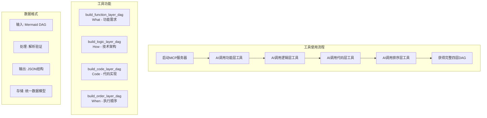

# 四层DAG构建工具使用指南

```
Version: v1.0.0
Author: AI Assistant + User
Date: 2024-12-20
Purpose: 四层DAG循环迭代构建工具的使用说明
Dependencies: mcp-DAG-planner, FastMCP, Mermaid
```



## 🎯 工具概述

本项目实现了 **四层DAG循环迭代构建** 的核心MCP工具集，包含4个主要工具：

1. **`build_function_layer_dag`** - 构建功能层DAG (What Layer)
2. **`build_logic_layer_dag`** - 构建逻辑层DAG (How Layer)  
3. **`build_code_layer_dag`** - 构建代码层DAG (Code Layer)
4. **`build_order_layer_dag`** - 构建排序层DAG (When Layer)

## 🚀 快速开始

### 1. 启动MCP服务器

```bash
cd mcp-DAG-planner
python -m src.mcp_feedback_enhanced
```

### 2. 在MCP客户端中调用工具

#### 功能层构建
```python
# AI调用示例
result = build_function_layer_dag(
    project_description="构建电商用户认证系统",
    mermaid_dag="""
    graph TD
        A[用户注册] --> B[用户登录]
        B --> C[权限验证]
        C --> D[会话管理]
    """,
    business_requirements="用户注册、登录、权限管理"
)
```

#### 逻辑层构建
```python
result = build_logic_layer_dag(
    function_layer_result=previous_result,
    mermaid_dag="""
    graph TD
        A[AuthService] --> B[UserService]  
        B --> C[PermissionService]
        C --> D[SessionService]
    """,
    technical_architecture="微服务架构 + JWT认证"
)
```

#### 代码层构建
```python
result = build_code_layer_dag(
    logic_layer_result=previous_result,
    mermaid_dag="""
    graph TD
        A[auth_service.py] --> B[user_model.py]
        B --> C[permission_manager.py] 
        C --> D[session_handler.py]
    """,
    implementation_details="Python Flask + SQLAlchemy"
)
```

#### 排序层构建
```python
result = build_order_layer_dag(
    code_layer_result=previous_result,
    mermaid_dag="""
    graph TD
        A[初始化数据库] --> B[部署认证服务]
        B --> C[配置API网关]
        C --> D[系统测试]
    """,
    execution_strategy="分阶段部署 + 增量发布"
)
```

## 📋 工具详细说明

### 🎯 build_function_layer_dag - 功能层构建

**用途**: 构建业务功能需求层，专注于 "做什么"

**输入参数**:
- `project_description`: 项目整体描述和目标
- `mermaid_dag`: 功能层的Mermaid DAG描述
- `business_requirements`: 具体业务需求列表

**专注领域**:
- 业务功能识别和分解
- 功能模块依赖关系  
- 用户需求到功能的映射
- 功能优先级和价值评估

**输出示例**:
```json
{
  "success": true,
  "layer_type": "function",
  "layer_name": "功能层 (What Layer)",
  "description": "业务目标和功能需求层",
  "parsed_dag": {
    "metadata": {
      "layer": "function",
      "focus": ["业务功能识别", "功能模块依赖", "需求映射", "优先级评估"],
      "node_count": 4,
      "edge_count": 3
    }
  },
  "validation": {
    "is_valid": true,
    "validation_messages": ["功能层 DAG 接收成功"]
  }
}
```

### ⚙️ build_logic_layer_dag - 逻辑层构建

**用途**: 构建技术架构设计层，专注于 "怎么做"

**输入参数**:
- `function_layer_result`: 功能层的构建结果
- `mermaid_dag`: 逻辑层的Mermaid DAG描述  
- `technical_architecture`: 技术架构详细设计

**专注领域**:
- 技术架构设计
- 系统组件关系
- API和接口定义
- 数据流和控制流

### 💻 build_code_layer_dag - 代码层构建

**用途**: 构建代码实现架构层，专注于 "代码结构"

**输入参数**:
- `logic_layer_result`: 逻辑层的构建结果
- `mermaid_dag`: 代码层的Mermaid DAG描述
- `implementation_details`: 实现细节和技术选型

**专注领域**:
- 代码模块结构
- 文件组织架构
- 类和函数设计  
- 依赖关系管理

### 📅 build_order_layer_dag - 排序层构建

**用途**: 构建执行顺序规划层，专注于 "什么时候做"

**输入参数**:
- `code_layer_result`: 代码层的构建结果
- `mermaid_dag`: 排序层的Mermaid DAG描述
- `execution_strategy`: 执行策略和时序安排

**专注领域**:
- 执行顺序规划
- 任务依赖关系
- 资源分配计划
- 时间节点安排

## 🧪 测试验证

运行测试脚本验证工具功能：

```bash
cd mcp-DAG-planner  
python test_four_layer_tools.py
```

测试将验证：
- ✅ 所有4个工具能正常调用
- ✅ Mermaid DAG解析功能
- ✅ JSON结果输出格式
- ✅ 错误处理机制

## 📊 输出数据结构

每个工具都返回统一的JSON格式：

```json
{
  "success": true,              // 构建是否成功
  "layer_type": "function",     // 层级类型
  "layer_name": "功能层",       // 层级名称
  "description": "...",         // 层级描述
  "input_data": {...},          // 输入数据记录
  "parsed_dag": {...},          // 解析后的DAG数据
  "validation": {...},          // 验证结果
  "cross_layer_mapping": {...}, // 跨层映射关系
  "storage_info": {...}         // 存储信息
}
```

## 🔄 迭代构建流程

1. **启动**: AI根据项目需求开始迭代
2. **功能层**: 分析业务需求，构建功能DAG
3. **逻辑层**: 基于功能层，设计技术架构
4. **代码层**: 基于逻辑层，规划代码结构  
5. **排序层**: 基于代码层，制定执行计划
6. **验证**: 检查四层一致性和完整性
7. **迭代**: 根据验证结果决定是否继续优化

## 📝 注意事项

1. **顺序依赖**: 工具需要按顺序调用，后层依赖前层结果
2. **Mermaid格式**: 输入的DAG必须是有效的Mermaid语法
3. **JSON传递**: 层间结果通过JSON字符串传递
4. **错误处理**: 工具内置错误处理，返回详细错误信息
5. **调试模式**: 设置`MCP_DEBUG=true`启用详细日志

## 🎯 下一步计划

- [ ] 添加Mermaid DAG语法验证
- [ ] 实现跨层一致性检查
- [ ] 支持graphology/ReactFlow格式转换
- [ ] 添加批准界面WebUI集成
- [ ] 实现迭代历史管理和版本控制

---

通过这4个核心工具，我们已经实现了四层DAG构建的基础功能。AI模型现在可以通过MCP协议调用这些工具，接受Mermaid DAG输入，并获得结构化的JSON输出结果！🚀 